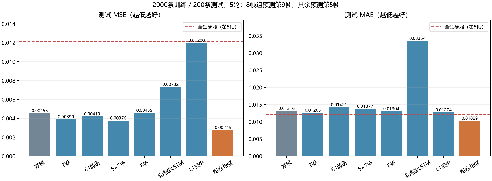
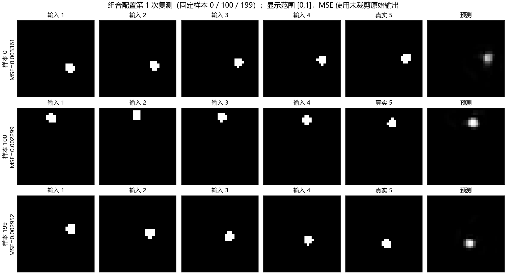

# 正式实验结果索引

原始数据见同目录 JSON；此文件为实验数据索引，非正式实验报告。

| 组 | 测试 MSE | 测试 MAE | 验证 MSE | 参数量 | 纯训练秒 | 训练+逐轮评估秒 |
|---|---:|---:|---:|---:|---:|---:|
| baseline | 0.00454742 | 0.01315643 | 0.00471109 | 38,433 | 3.414 | 3.582 |
| exp1 | 0.00389724 | 0.01263329 | 0.00405086 | 112,289 | 6.527 | 6.765 |
| exp2 | 0.00419141 | 0.01421409 | 0.00434873 | 150,593 | 4.081 | 4.334 |
| exp3 | 0.00376244 | 0.01376650 | 0.00398015 | 106,017 | 2.708 | 2.908 |
| exp4 | 0.00458627 | 0.01304220 | 0.00472301 | 38,433 | 6.184 | 6.403 |
| exp5 | 0.00731894 | 0.03354251 | 0.00739187 | 1,575,936 | 0.413 | 0.451 |
| exp6 | 0.01199658 | 0.01273668 | 0.01221858 | 38,433 | 3.181 | 3.304 |
| best_run1 | 0.00276185 | 0.01028703 | 0.00286881 | 1,236,289 | 14.486 | 15.630 |
| best_run2 | 0.00276185 | 0.01028703 | 0.00286881 | 1,236,289 | 14.279 | 15.435 |
| best_run3 | 0.00276185 | 0.01028703 | 0.00286881 | 1,236,289 | 14.372 | 15.522 |

组合：['exp1', 'exp2', 'exp3']；测试 MSE 三次均值 0.00276185，较基线降低 39.27%；MAE 均值 0.01028703。

三次同种子结果逐位相同，属于确定性检查，不能视为三份独立统计样本。

计时为GPU同步后的实际时长。纯训练指训练循环（含取批、数据传输、前后向与更新）；训练+评估另含逐轮测试/验证。两者均不含环境加载、数据生成、绘图、保存、恢复时废弃的未完成轮次。

