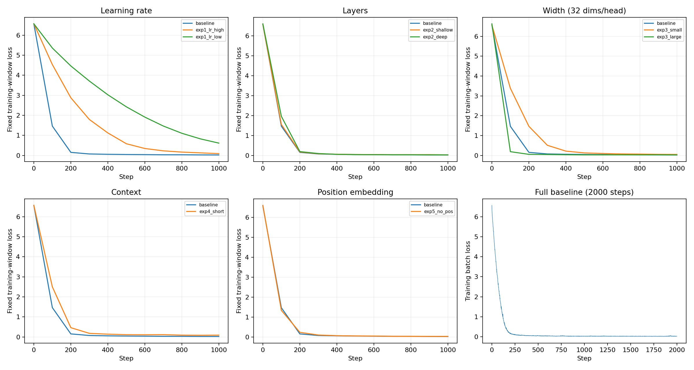

# 实验三完整结果

所有loss均来自训练语料，不是测试集指标。参数、配置及原始记录见各组result.json。

|配置|步数|参数量|末步训练loss|最后100步均值|固定训练窗口loss|训练秒|
|---|---:|---:|---:|---:|---:|---:|
|baseline_1000|1000|502656|0.027142|0.028330|0.022845|59.92|
|baseline|2000|502656|0.029191|0.030087|0.023166|118.77|
|exp1_lr_high|1000|502656|0.101520|0.114096|0.090003|108.92|
|exp1_lr_low|1000|502656|0.623159|0.724663|0.613656|57.00|
|exp2_shallow|1000|304384|0.029868|0.031953|0.027899|34.62|
|exp2_deep|1000|899200|0.032410|0.030263|0.027648|107.71|
|exp3_small|1000|153024|0.049458|0.053991|0.046519|30.26|
|exp3_large|1000|1791744|0.030819|0.028371|0.020955|141.65|
|exp4_short|1000|490368|0.107180|0.102203|0.090093|16.15|
|exp5_no_pos|1000|486272|0.032457|0.031053|0.027912|51.95|

计时仅含取批、前后向、优化器更新及loss读取，不含评估、保存、绘图、采样和排队。各组CPU同型号、同线程数；并行作业和共享节点负载仍会影响耗时。

上下文32组每步训练字符为基线的1/4；嵌入维度组保持每头32维，因此同步调整头数。

## 采样与选做结果

|配置|温度|top-k|重复3-gram比例|语料10-gram匹配率|不同字符比例|
|---|---:|---:|---:|---:|---:|
|[temp05_k20](sampling/temp05_k20.txt)|0.5|20|0.34%|99.83%|69.33%|
|[temp10_k20](sampling/temp10_k20.txt)|1.0|20|0.34%|100.00%|68.67%|
|[temp15_k20](sampling/temp15_k20.txt)|1.5|20|2.19%|65.45%|66.50%|
|[temp10_k5](sampling/temp10_k5.txt)|1.0|5|0.34%|100.00%|72.83%|
|[temp10_all](sampling/temp10_all.txt)|1.0|699|0.34%|100.00%|68.67%|
|[bonus_no_repeat3](sampling/bonus_no_repeat3.txt)|1.0|20|0.00%|93.72%|68.67%|

比例均按生成的200字符计算（不含提示词），保留标点和换行；三段取平均。它们描述重复、多样性与语料重合，不是语义质量或原创性的充分判据。
